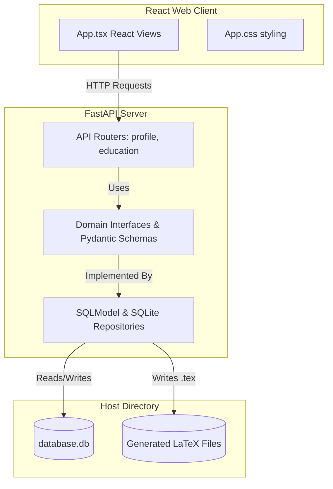

# Project Knowledge Transfer (KT) Document: Career Intelligence System (V1)

Welcome to the **Career Intelligence System** (often referred to as **ResumeSuite**). This document serves as a comprehensive transfer of knowledge regarding the project's purpose, technical design, implementation progress, and roadmap.

---

## 1. Project Overview & Vision

The **Career Intelligence System** is a secure, local-first, single-user developer utility built to solve two main challenges faced by technical job hunters:
1. **Memory Decay (Career Memory Loss):** Over time, developers forget the granular details, specific metrics, and technologies used in past projects and roles. They lose the "evidence" of their accomplishments.
2. **Resume Tailoring Overhead:** Creating tailored resumes for different roles and organizations is extremely tedious. Adapting bullet points to fit specific Job Descriptions (JDs) and company contexts while maintaining ATS readability is slow, error-prone, and frustrating. Manual editing of LaTeX templates is time-consuming and leads to layout breakage.

### Core Solution
The system operates as a private career repository that extracts unstructured professional memories into clean, reusable units called **Atomic Facts** (Action + Metric/Result + Skills used). It then uses these facts to synthesize high-impact resume bullet points tailored to target job descriptions, formatting them into compile-ready **LaTeX source code** that matches the popular **"Jake's Resume"** template layout under a strict **1-page constraint**.

For details, review:
* [Product Requirements Document V1.md](file:///c:/Users/Rushikesh/Desktop/Data/PersonalPrograms/ResumeSuite/Product%20Requirements%20Document%20V1.md)
* [Technical Design Document.md](file:///c:/Users/Rushikesh/Desktop/Data/PersonalPrograms/ResumeSuite/Technical%20Design%20Document.md)
* [Engineering Specification.md](file:///c:/Users/Rushikesh/Desktop/Data/PersonalPrograms/ResumeSuite/Engineering%20Specification.md)

---

## 2. Technical Architecture & Tech Stack

The application is structured around a **Local-First Architecture** ensuring 100% privacy (no remote storage, no cloud database requirements, no telemetry). It uses a clean separation of concerns matching the **Repository Pattern** to decouple the domain/business logic from persistence libraries.



### Technology Stack
* **Frontend:** React, TypeScript, Vite, Vanilla CSS.
* **Backend:** FastAPI, Python 3.12, SQLModel (ORM mapping SQL tables dynamically to Pydantic models), Uvicorn.
* **Database:** SQLite (local-first, serverless relational database).
* **Containerization:** Docker & Docker Compose (`docker-compose.yaml` spinning up both backend and frontend containers with volume mappings to synchronize local source files).

---

## 3. What Was Done (Implemented Slices)

The project implementation is structured around **vertical slices** (User Value → UI → Data Handler → Processing Logic → File Export). To date, the project has successfully completed **Slices 1 & 2** (Milestone 1 foundation).

### Slice 1: Setup & Web Containerization (Complete)
* **Goal:** Spin up a local containerized developer environment.
* **Done:** 
  * Configured [docker-compose.yaml](file:///c:/Users/Rushikesh/Desktop/Data/PersonalPrograms/ResumeSuite/docker-compose.yaml) running two services: `backend` (FastAPI on port `8000`) and `frontend` (Vite dev server on port `5173`).
  * Created [Dockerfile](file:///c:/Users/Rushikesh/Desktop/Data/PersonalPrograms/ResumeSuite/backend/Dockerfile) in the backend to install Python packages listed in [requirements.txt](file:///c:/Users/Rushikesh/Desktop/Data/PersonalPrograms/ResumeSuite/backend/requirements.txt) and execute Uvicorn with auto-reload.
  * Created [Dockerfile](file:///c:/Users/Rushikesh/Desktop/Data/PersonalPrograms/ResumeSuite/frontend/Dockerfile) in the frontend using Node 20 to install packages and spin up the Vite development server.

### Slice 2: Profile & Education CRUD (Base Info) (Complete)
* **Goal:** Establish basic database schema, repository interfaces, API endpoints, and a responsive Web UI tab selection to manage personal demographics and education.
* **Done:**
  * **Database Layer:** Defined SQLModel structure for [ProfileTable](file:///c:/Users/Rushikesh/Desktop/Data/PersonalPrograms/ResumeSuite/backend/app/persistence/models.py#L6-L18) and [EducationTable](file:///c:/Users/Rushikesh/Desktop/Data/PersonalPrograms/ResumeSuite/backend/app/persistence/models.py#L19-L34).
  * **Domain Layer:** Built validation schemas ([ProfileBase](file:///c:/Users/Rushikesh/Desktop/Data/PersonalPrograms/ResumeSuite/backend/app/domain/schemas.py#L7-L14) and [EducationBase](file:///c:/Users/Rushikesh/Desktop/Data/PersonalPrograms/ResumeSuite/backend/app/domain/schemas.py#L26-L33)) and abstract repository interfaces ([ProfileRepository](file:///c:/Users/Rushikesh/Desktop/Data/PersonalPrograms/ResumeSuite/backend/app/domain/repositories.py#L6-L17) and [EducationRepository](file:///c:/Users/Rushikesh/Desktop/Data/PersonalPrograms/ResumeSuite/backend/app/domain/repositories.py#L20-L46)) to enforce boundaries.
  * **Persistence Repositories:** Created SQL implementations ([SQLProfileRepository](file:///c:/Users/Rushikesh/Desktop/Data/PersonalPrograms/ResumeSuite/backend/app/persistence/repositories.py#L8-L40) and [SQLEducationRepository](file:///c:/Users/Rushikesh/Desktop/Data/PersonalPrograms/ResumeSuite/backend/app/persistence/repositories.py#L43-L93)) handling single-user constraints (e.g. upserting the single profile record) and cascade relationships.
  * **FastAPI Routers:** Implemented endpoints for fetching/saving candidate profile records and CRUDing educational histories.
  * **Web Dashboard:** Developed a clean, responsive web interface in [App.tsx](file:///c:/Users/Rushikesh/Desktop/Data/PersonalPrograms/ResumeSuite/frontend/src/App.tsx) comprising:
    * **Overview View:** Confirms connected container health, SQLite storage path, and database type.
    * **Demographics Form:** Manages full name, email, phone, location, website/portfolio, LinkedIn, and GitHub.
    * **Education Credentials:** Tabular view and form input fields to add, edit, update, or delete school credentials (degree, major, institution, dates, and GPA).

---

## 4. Key Files Walkthrough

Here is a map of the important codebase directories and files with their respective purposes:

### Configuration & Tooling
* [docker-compose.yaml](file:///c:/Users/Rushikesh/Desktop/Data/PersonalPrograms/ResumeSuite/docker-compose.yaml) – Multi-container configuration defining environment variables, port mappings, and volume sync directories.
* [.env](file:///c:/Users/Rushikesh/Desktop/Data/PersonalPrograms/ResumeSuite/.env) – Local configuration file storing the `GEMINI_API_KEY` for LLM tasks.
* [backend/requirements.txt](file:///c:/Users/Rushikesh/Desktop/Data/PersonalPrograms/ResumeSuite/backend/requirements.txt) – Python package dependency requirements (FastAPI, SQLModel, google-generativeai, pytest, alembic, etc.).

### Backend Modules
* [backend/app/main.py](file:///c:/Users/Rushikesh/Desktop/Data/PersonalPrograms/ResumeSuite/backend/app/main.py) – Application entry point. Configures lifespan database initialization, CORS headers allowing Vite requests, and includes routers.
* [backend/app/core/uuid.py](file:///c:/Users/Rushikesh/Desktop/Data/PersonalPrograms/ResumeSuite/backend/app/core/uuid.py) – Utility to generate UUIDv7 (time-ordered UUIDs) to ensure chronological database insertions.
* [backend/app/persistence/db.py](file:///c:/Users/Rushikesh/Desktop/Data/PersonalPrograms/ResumeSuite/backend/app/persistence/db.py) – SQLite connection session pool provider. Configures thread compatibility locks and statement wait queues.
* [backend/app/persistence/models.py](file:///c:/Users/Rushikesh/Desktop/Data/PersonalPrograms/ResumeSuite/backend/app/persistence/models.py) – SQLModel ORM entities mapping classes to SQLite database tables.
* [backend/app/persistence/repositories.py](file:///c:/Users/Rushikesh/Desktop/Data/PersonalPrograms/ResumeSuite/backend/app/persistence/repositories.py) – Concrete database logic queries implementing abstract repo boundaries.
* [backend/app/domain/schemas.py](file:///c:/Users/Rushikesh/Desktop/Data/PersonalPrograms/ResumeSuite/backend/app/domain/schemas.py) – Pydantic models for request serialization and API response payloads.
* [backend/app/domain/repositories.py](file:///c:/Users/Rushikesh/Desktop/Data/PersonalPrograms/ResumeSuite/backend/app/domain/repositories.py) – Abstract Base Classes representing repositories interfaces.

### Frontend Modules
* [frontend/src/App.tsx](file:///c:/Users/Rushikesh/Desktop/Data/PersonalPrograms/ResumeSuite/frontend/src/App.tsx) – Single-page React entry point holding layouts, forms handlers, tab switching state, and API fetch queries.
* [frontend/src/App.css](file:///c:/Users/Rushikesh/Desktop/Data/PersonalPrograms/ResumeSuite/frontend/src/App.css) – Component CSS stylesheet implementing the dark-mode layout theme, hover gradients, and status widgets.

---

## 5. Completed Database & API Endpoint Design

### Database Table Schemas
1. **`profiles` Table:**
   * `id`: `UUID` (Primary Key, generated via UUIDv7)
   * `name`: `VARCHAR` (Required, Full name)
   * `email`: `VARCHAR` (Required)
   * `phone`: `VARCHAR` (Required)
   * `location`: `VARCHAR` (Required, e.g. "Boston, MA")
   * `website`: `VARCHAR` (Optional)
   * `linkedin`: `VARCHAR` (Optional)
   * `github`: `VARCHAR` (Optional)
2. **`education` Table:**
   * `id`: `UUID` (Primary Key, generated via UUIDv7)
   * `institution`: `VARCHAR` (Required, school name)
   * `location`: `VARCHAR` (Required)
   * `degree`: `VARCHAR` (Required, e.g., "B.S.")
   * `major`: `VARCHAR` (Required, e.g., "Computer Science")
   * `start_date`: `VARCHAR` (Required)
   * `graduation_date`: `VARCHAR` (Required)
   * `gpa`: `VARCHAR` (Optional)
   * `profile_id`: `UUID` (Foreign Key referencing `profiles.id`, ensuring entries are linked to the active profile)

### Implemented HTTP Endpoints
* `GET /` – Returns API service name, health confirmation, and version.
* `GET /api/profile` – Checks and retrieves the current profile, returns `404` if none has been created.
* `POST /api/profile` – Updates the profile if it exists (single-user constraint) or inserts a new one.
* `POST /api/education` – Inserts a new academic record.
* `GET /api/education/profile/{profile_id}` – Retrieves a list of education entries linked to the specific profile UUID.
* `PUT /api/education/{id}` – Modifies an existing educational credential.
* `DELETE /api/education/{id}` – Deletes the specific academic record.

---

## 6. Next Steps & Development Roadmap

To complete the full V1 implementation, developers should build upon Slices 1 and 2 following the order below (documented in the [Implementation Plan.md](file:///c:/Users/Rushikesh/Desktop/Data/PersonalPrograms/ResumeSuite/Implementation%20Plan.md)):

```
[Slices 1-2 (Done)] ➔ [Slice 3: Vault CRUD] ➔ [Slice 4: Fact Extraction] 
                    ➔ [Slice 5: Smart Merge] ➔ [Slice 6: Relevance Rank] 
                    ➔ [Slice 7: Budget Tracker] ➔ [Slice 8: Synthesis] 
                    ➔ [Slice 9: LaTeX Output] ➔ [Slice 10: History Export]
```

### 1. Slice 3: Raw Memory Ingest & Basic Vault CRUD
* **Goal:** Set up database models, API endpoints, and React views to allow the user to input work experiences, projects, and hackathons/competitions.
* **Tasks:**
  * Define ORM models for `WorkExperience`, `Project`, and `Hackathon` tables in [models.py](file:///c:/Users/Rushikesh/Desktop/Data/PersonalPrograms/ResumeSuite/backend/app/persistence/models.py).
  * Build endpoints to CRUD these items containing metadata (dates, names, titles) and a primary **raw description** textarea field.

### 2. Slice 4: AI Atomic Fact Extraction UI
* **Goal:** Parse unstructured description paragraphs into structured "Action-Result-Skills" segments.
* **Tasks:**
  * Integrate the `google-generativeai` package to send raw descriptive texts to the Gemini API using system instructions.
  * Receive a structured JSON list of facts containing `action`, `metric_result`, and `skills` lists.
  * Build a validation UI listing the parsed facts, allowing the user to review, edit, or delete them before committing them to the Vault database.

### 3. Slice 5: Smart Vault Merging & Deduplication
* **Goal:** Merge new text/accomplishments into existing experiences.
* **Tasks:**
  * Implement comparison logic to crosscheck new facts against existing ones. If semantic overlap is high, prompt to merge/update metric numbers instead of creating a duplicate bullet point.

### 4. Slice 6: Relevance Ranking & Debug Keyword Log
* **Goal:** Accept target Job Description (JD) and Company Context to sort experiences.
* **Tasks:**
  * Parse JD to extract key requirements and search tags.
  * Compare matching criteria against Vault items to output relevance scores. Renders items on the UI in ranked order (descending).

### 5. Slice 7: Content Budget Selector (Budget Tracker)
* **Goal:** Enforce the single-page constraints.
* **Tasks:**
  * Create checkboxes/counters on the UI next to experiences' atomic facts.
  * Maintain a live counter updating selected count (`N / 10`). Disable the "Generate Resume" action button if total bullets exceed `10`.

### 6. Slice 8: Resume Synthesis & Skills Prioritization
* **Goal:** Compose tailored professional bullets and sort the Skills section.
* **Tasks:**
  * Call Gemini to synthesize selected facts into tailored, professional CV bullets (Google XYZ or STAR formulas) relevant to the JD constraints.
  * Sort the baseline skills listing so that skills directly matching the JD appear first, followed by company-focused skills, and then related general skills.

### 7. Slice 9: LaTeX Template Mapping
* **Goal:** Render the final LaTeX source code.
* **Tasks:**
  * Map synthesized profile links, sorted skills, education, and tailored bullets into a hardcoded string representation of **Jake's Resume LaTeX template**.
  * Show the code in a syntax-highlighted textarea with a **"Copy Source"** button to export to LaTeX platforms (e.g. Overleaf).

### 8. Slice 10: Local File Archiving & History Ledger
* **Goal:** Auto-save files to the local folder structure.
* **Tasks:**
  * On generation, write the LaTeX string to the host system disk under `resumes/<company_name>/<job_role>/<resume_date_time>.tex`.
  * Update a local JSON/YAML index ledger logging metadata (timestamp, company, job role, file path, and matching keywords).

---

## 7. How to Run the Project Locally

### Running with Docker Compose (Recommended)
From the root project directory, run:
```bash
docker-compose up --build
```
This command builds the images, sets up port mapping, and boots both servers:
* **Frontend client:** [http://localhost:5173](http://localhost:5173)
* **Backend API:** [http://localhost:8000](http://localhost:8000)

### Manual Setup (Without Docker)
If you prefer running the servers manually on your local system:

**Backend Setup:**
1. Navigate to backend:
   ```bash
   cd backend
   ```
2. Create and activate a python virtual environment.
3. Install dependencies:
   ```bash
   pip install -r requirements.txt
   ```
4. Start Uvicorn:
   ```bash
   uvicorn app.main:app --host 127.0.0.1 --port 8000 --reload
   ```

**Frontend Setup:**
1. Navigate to frontend:
   ```bash
   cd frontend
   ```
2. Install npm packages:
   ```bash
   npm install
   ```
3. Start the Vite server:
   ```bash
   npm run dev
   ```
   
---
*Document Compiled on: 2026-06-29 &bull; Prepared for: Development Handover*
