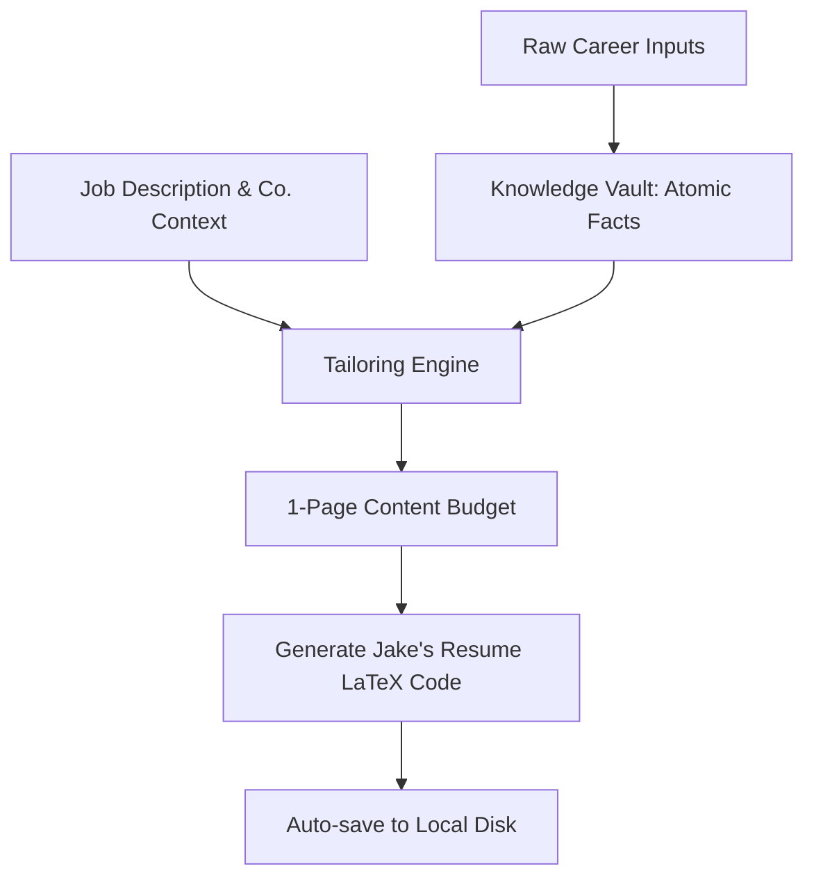

# Product Requirements Document (PRD)
## Career Intelligence System (V1)

---

## 1. Product Vision & Problem Statement

### Product Vision
To build a reliable, evidence-based career memory and automation platform that captures professional growth in real-time, eliminates the friction of tailoring job applications, and guarantees high-quality, ATS-friendly career assets.

### Problem Statement
Active and passive job seekers, particularly in technical fields, face two critical challenges:
1. **Memory Decay (Career Memory Loss):** Over time, individuals forget the granular details, specific metrics, and technologies used in past projects and roles. They lose the "evidence" of their accomplishments.
2. **Resume Tailoring Overhead:** Creating tailored resumes for different roles and organizations is extremely tedious. Adapting bullet points to fit specific Job Descriptions (JDs) and company contexts while maintaining ATS readability is slow, error-prone, and frustrating. Editing LaTeX templates manually is time-consuming and leads to formatting layout issues.

---

## 2. User Persona

### Primary Persona: Rushikesh (The Career-Builder Developer)
* **Demographics:** Software engineer, tech professional, or technical student.
* **Behaviors:** Active job hunter or strategic developer tracking career growth. Prefers clean, structured layouts (e.g., Jake's Resume LaTeX style).
* **Goals:** 
  * Wants a central, private vault to store everything they've ever built without losing detail.
  * Wants to apply to target jobs with high-quality, customized resumes in minutes, not hours.
  * Wants to ensure the resume fits exactly on a single page and compiles cleanly without manual typesetting hassle.
* **Pain Points:** 
  * Forgets specific project details beyond the core description when updating their CV months later.
  * Struggles to frame accomplishments in high-impact professional resume bullet styles (such as Google XYZ, STAR, or action-oriented formats).
  * Spends hours tweaking `.tex` files for formatting correctness when applying to different jobs.

---

## 3. V1 Scope vs. Future Backlog

To deliver immediate value, we will strip away all unnecessary complexity (such as automated web lookups, multi-page layouts, and direct PDF compiling) and focus on a highly refined local web utility.

### V1 Scope (In-Scope)
* **Single User Local Platform:** Designed to run locally (via Docker) with a clean Web UI.
* **Minimalist Knowledge Vault:** Supports Profile, Work/Internship Experience, Projects, Hackathons & Competitions, Education, and Skills.
* **Atomic Fact Extraction:** Extracts and structures raw inputs into action-result matched "Atomic Facts" at entry time, with full manual override (CRUD).
* **Incremental Updates:** Smart merging of new memories with existing entries without duplicating facts.
* **JD & Manual Company Context Input:** Capturing Job Description + Company Name + Company Context.
* **Content Budgeting UI:** Enforces a strict total bullet budget during selection to guarantee a 1-page output.
* **Company-Aware Skills Ordering:** Auto-structures and prioritizes skills based on JD match, company focus, and related fields.
* **LaTeX Source Output:** Auto-generates clean, compile-ready LaTeX code in the "Jake's Resume" style.
* **Structured Local Disk Auto-Save:** Automatically saves generated `.tex` files to local directories: `resumes/<company_name>/<job_role>/<resume_date_time>.tex` and stores generation metadata along with JD matched keywords in a local history log file.

### Future Roadmap (Out-of-Scope)

| Feature | Release |
| :--- | :--- |
| **PDF Generation:** Automated server-side PDF rendering so the user can download a compiled PDF. | **V2** |
| **History Explorer:** Web-based UI to view, compare, and restore previously generated resumes. | **V2** |
| **AI Profile Insights Dashboard:** Domain mastery mapping, skill distribution profiling, and role-selection probability analytics with points-based visualizations that update dynamically with Vault changes. | **V2/V3** |
| **Academic/Career Credentials:** Support for patents, conferences, certifications, and publications in the Vault and resume generator. | **V3/V4** |
| **ATS Score Analysis:** Scoring the resume against the target JD and suggesting improvements. | **V3** |
| **Semi-Automated Company Lookup:** Automating tech-stack/product context gathering using company names. | **V3** |
| **Custom Template Support:** Uploading custom LaTeX templates with dynamic tags/placeholders. | **V5** |

---

## 4. User Stories

### Vault Management & Extraction
* **US1 - Raw Data Entry:** As a user, I want to paste raw, unstructured text about a project or job so that I don't have to worry about formatting or grammar when capturing career memories.
* **US2 - Fact-Result Attribution:** As a user, I want the system to parse my raw input into structured "Atomic Facts" pairing actions directly with results (e.g. *Action X resulted in Y*), so that the core meaning is preserved without misinterpretation.
* **US3 - Atomic Fact CRUD:** As a user, I want to view, add, edit, or delete these parsed Atomic Facts in the Vault so that I can ensure my career database is 100% accurate.
* **US4 - Smart Vault Merging:** As a user, when I enter new details about a project that already exists in my Vault, I want the system to identify duplicates, update existing facts with new metrics, and append new details without creating a separate entry.

### Tailoring & Generation
* **US5 - Job Input Context:** As a user, I want to input a Job Description, the target Company Name, and a brief description of what the company does/builds, so the system has the necessary context to customize my application.
* **US6 - Relevancy Ranking:** As a user, I want to see my work experiences, projects, and hackathons/competitions ranked in descending order of relevance to the JD (prioritizing entries with strong impact), so I can easily select the best content to display.
* **US7 - Content Budget Enforcer:** As a user, I want to see a "Bullet Point Budget" indicator while selecting experiences, projects, and hackathons/competitions, warning or restricting me if my selections will exceed a 1-page LaTeX compilation threshold.
* **US8 - Bullet Point Synthesis Formatting:** As a user, I want the tailoring engine to synthesize the selected Atomic Facts into high-impact professional resume bullet points (incorporating writing styles like Google XYZ, STAR, or action-oriented structures) that align directly with the JD's requirements.
* **US9 - Company-Aware Skills:** As a user, I want the Skills section in the resume to prioritize skills matching the JD first, followed by skills useful for the company's product line, and then general related skills.

### Export & History
* **US10 - Copy LaTeX Source:** As a user, I want to copy the generated LaTeX source code with a single click so that I can instantly paste it into Overleaf.
* **US11 - Auto-Save to Disk:** As a user, when I generate a resume, I want the system to automatically save the completed `.tex` file to `resumes/<company_name>/<job_role>/<resume_date_time>.tex` on my local drive, alongside logging the matching JD keywords, so that I have a persistent physical copy of every application and full debug logging of what keywords were matched.

---

## 5. Functional Requirements

### 5.1 Knowledge Vault Module
1. **Schema Limits:** The schema is strictly limited to Profile, Work Experience, Projects, Hackathons & Competitions, Education, and Skills.
2. **Atomic Fact Store:** Each Project, Experience, or Hackathon/Competition entry must house a sub-list containing multiple "Atomic Facts" (enabling a comprehensive list of accomplishments per entry). Each Atomic Fact represents a paired action-result point consisting of:
   * Action taken (e.g., "Refactored legacy query engine").
   * Result/Metric achieved (e.g., "Reduced CPU utilization by 25%").
   * Skills utilized (e.g., "PostgreSQL", "Python").
3. **De-duplication Engine:** When matching new raw entries with existing database items, the system must compare semantic meanings of new atomic facts against existing ones. If a match is found, it updates/merges fields rather than duplicating.

### 5.2 Resume Tailoring Engine
1. **Relevance Computation:** Rank all Vault items (Experiences, Projects, and Hackathons/Competitions, emphasizing strong impact items) against the user's provided JD.
2. **Dynamic Bullet Synthesizer:** Take selected Atomic Facts and construct them into full prose sentences applying high-impact professional resume styles (incorporating formats like Google XYZ, STAR, or action-oriented achievements) tailored to the tone of the JD.
3. **Skills Categorization & Prioritization:** 
   * Match 1: Core skills found in both the JD and the Vault.
   * Match 2: Vault skills related to the entered Company Context.
   * Match 3: Remaining Vault skills that are complementary to the role.
   * Format these sorted lists into standard LaTeX skills sections.

### 5.3 Budgeting & Layout Compiler
1. **The 1-Page Budget Constraint:** 
   * Maximum total bullet points permitted for generation is capped at **10**.
   * The UI must display a counter: `Allocated Bullet Points: N / 10`.
   * The user cannot proceed to generation if they select components exceeding the budget, or the system must truncate bullets to fit the budget.
2. **Template Mapping:** The engine must inject the structured profile, skills, education, experiences, and projects into the pre-defined **Jake's Resume LaTeX Template**.

### 5.4 Export & Filesystem Integration
1. **Local Auto-Save:** The application must write files directly to the host machine's directory tree under `resumes/<company_name>/<job_role>/<resume_date_time>.tex`.
2. **History Ledger:** Save metadata (Company Name, Job Role, Timestamp [date and time], Path to `.tex` file, and the extracted JD matching keywords) to a local JSON/YAML file to act as the generation log for transparent verification and debugging.

---

## 6. Non-Functional Requirements

* **Performance:** Prioritize quality over generation speed. Fact extraction and resume tailoring can take up to **5 minutes** max if it ensures exceptionally robust, accurate, and high-quality outputs.
* **Portability:** The entire application must be deployable via a simple docker command (e.g. `docker-compose up`) to ensure quick local setup.
* **UI Responsiveness:** The Web UI should be responsive, modern, clean, and highly intuitive for desktop usage.
* **Security & Privacy:** Since professional credentials and private career details are stored, all data must reside locally on the host machine. No telemetry or external cloud storage of vault details is permitted.

---

## 7. Success Metrics

1. **Generation Efficiency:** Decreasing the average time it takes the user to tailor and compile a LaTeX resume for a specific application from **30+ minutes** to **under 2 minutes** (including copying/compiling).
2. **Formatting Reliability:** 100% of resumes generated using the content budget must compile on the first try in LaTeX, resulting in a clean **single-page document** with zero formatting overflow.
3. **Data Accuracy (Anti-Hallucination):** The tailored bullet points must represent real, evidence-backed achievements from the Vault. The system must not create fake metrics or false technological usages.

---
*End of Document. Approvals pending user feedback.*
